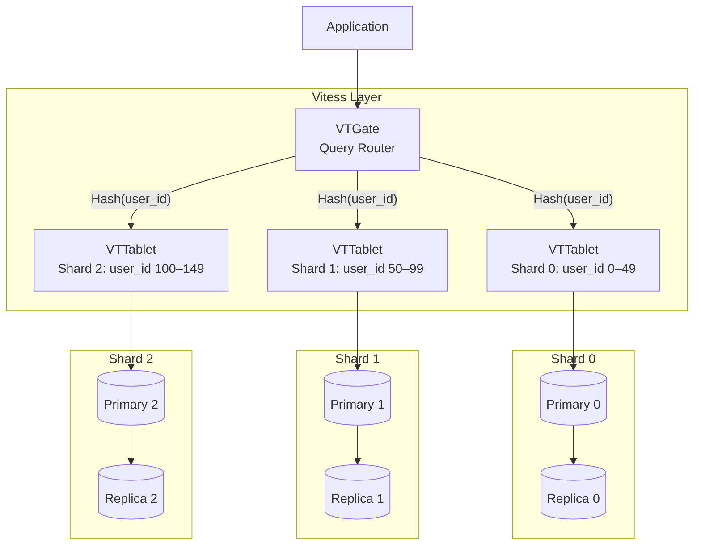
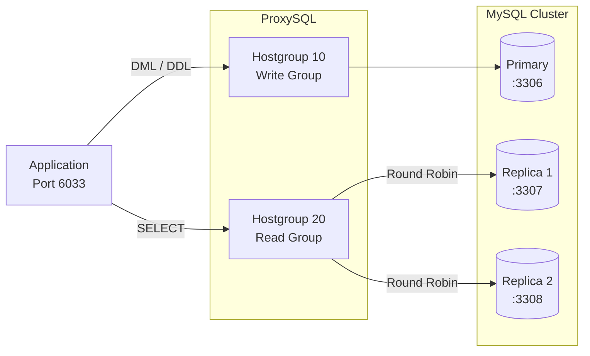

# Distributed Architecture / Kiến Trúc Phân Tán

## Sharding with Vitess / Phân Mảnh với Vitess

---

## ProxySQL Read/Write Splitting / Phân Tách Đọc/Ghi

---

## CAP Theorem Trade-offs / Đánh Đổi CAP

| Configuration | Consistency | Availability | Partition Tolerance |
|---------------|:-----------:|:------------:|:-------------------:|
| Single Primary (Async) | ✅ | ✅ | ⚠️ |
| Semi-sync Replication | ✅✅ | ⚠️ | ⚠️ |
| Group Replication (Paxos) | ✅✅ | ✅ | ✅ |
| Vitess Sharding | ⚠️ | ✅✅ | ✅✅ |
