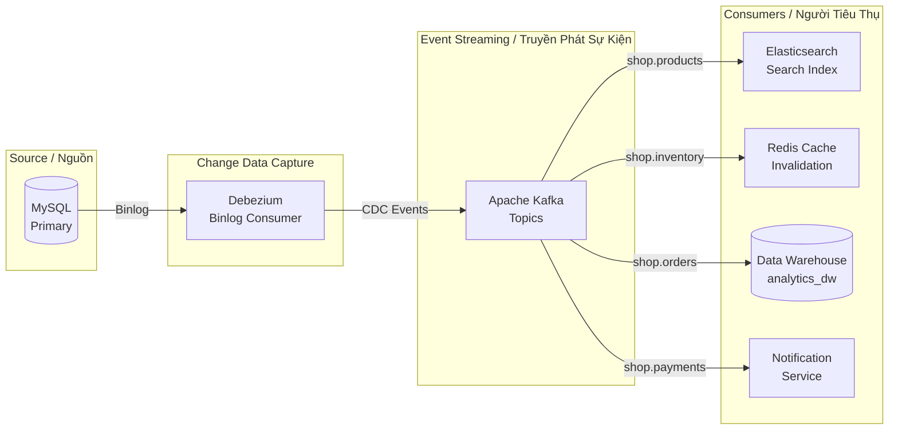
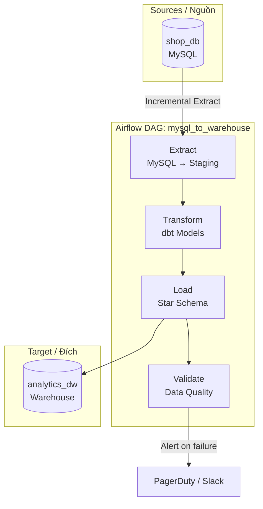
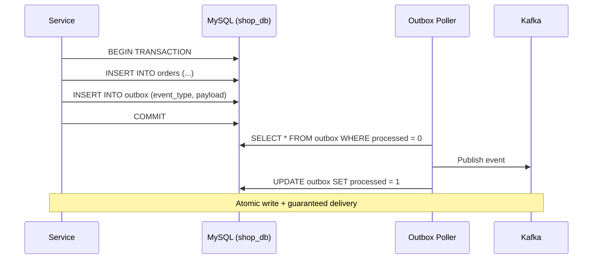

# ETL / CDC Data Pipeline / Pipeline Dữ Liệu ETL/CDC

## CDC Pipeline with Debezium + Kafka / Pipeline CDC với Debezium + Kafka

---

## Batch ETL Pipeline with Airflow / Pipeline ETL Batch với Airflow

---

## Outbox Pattern / Mẫu Outbox

