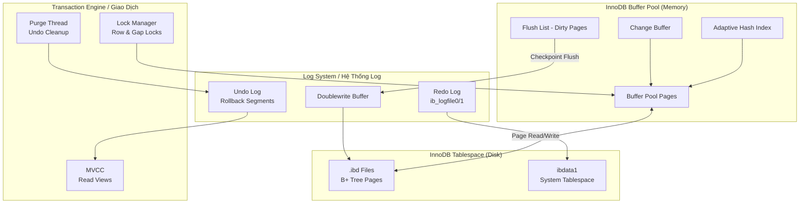

# InnoDB Internals Diagram / Sơ Đồ Nội Tại InnoDB

---

## Key Concepts / Khái Niệm Quan Trọng

| Component | Purpose | Tuning Parameter |
|-----------|---------|-----------------|
| **Buffer Pool** | Cache pages in memory | `innodb_buffer_pool_size` (70–80% RAM) |
| **Redo Log** | WAL for crash recovery | `innodb_log_file_size` |
| **Undo Log** | MVCC historical versions | `innodb_undo_tablespaces` |
| **Doublewrite Buffer** | Prevents torn page writes | `innodb_doublewrite` |
| **Adaptive Hash Index** | Auto-index hot data | `innodb_adaptive_hash_index` |
| **Change Buffer** | Defer secondary index writes | `innodb_change_buffer_max_size` |
| **Purge Thread** | Clean up old undo versions | `innodb_purge_threads` |
