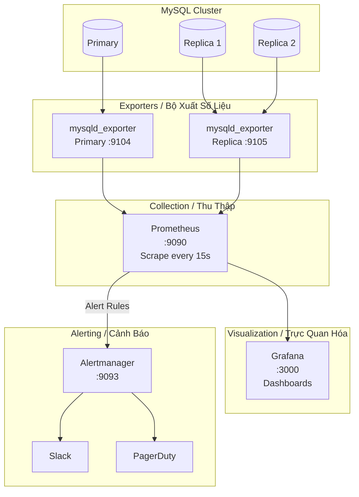

# Monitoring Stack / Stack Giám Sát

## Observability Architecture / Kiến Trúc Quan Sát

---

## Key Metrics to Monitor / Số Liệu Quan Trọng Cần Giám Sát

| Metric | Alert Threshold | Meaning |
|--------|:--------------:|---------|
| `mysql_global_status_threads_connected` | > 80% `max_connections` | Connection pressure |
| `mysql_global_status_innodb_row_lock_waits` | Spike > baseline | Lock contention |
| `mysql_slave_status_seconds_behind_master` | > 30s | Replication lag |
| `mysql_global_status_slow_queries` | Rate > 10/min | Query performance |
| `mysql_global_status_innodb_buffer_pool_reads` | High ratio | Cache miss — increase buffer pool |
| `mysql_global_status_aborted_connects` | > 0 | Auth/network issues |
| `node_disk_io_time_seconds_total` | > 80% utilization | Disk I/O bottleneck |
