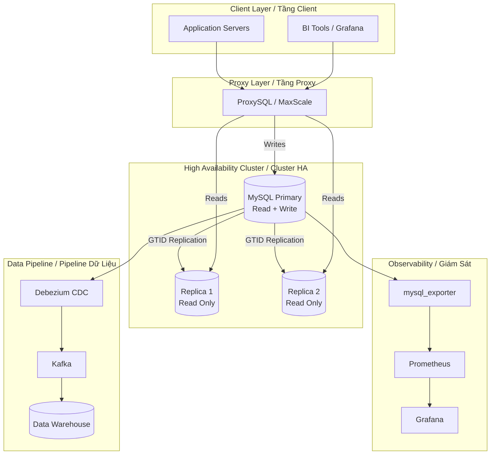

# MySQL Architecture Overview / Kiến Trúc Tổng Quan MySQL

---

## Component Responsibilities / Trách Nhiệm Từng Component

| Component | Role |
|-----------|------|
| **ProxySQL** | Read/write splitting, connection pooling, failover routing |
| **MySQL Primary** | Handles all writes, GTID-based replication source |
| **Replicas** | Read-only traffic, analytics queries, backup source |
| **Debezium** | Captures binlog changes → streams to Kafka |
| **Prometheus** | Scrapes mysql_exporter metrics every 15s |
| **Grafana** | Visualizes QPS, latency, replication lag, connections |
