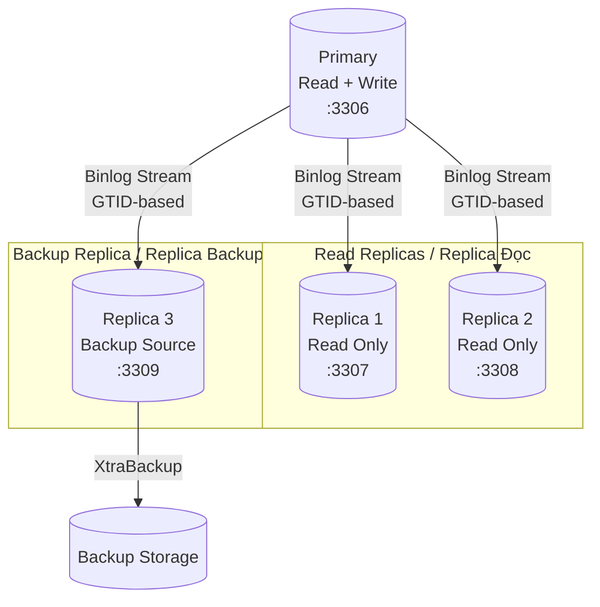
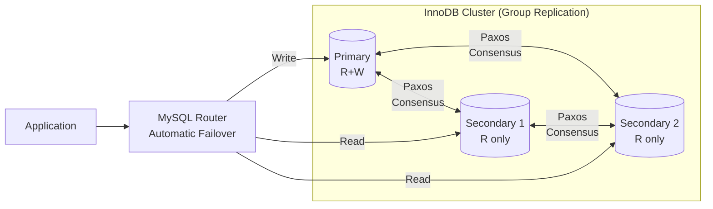
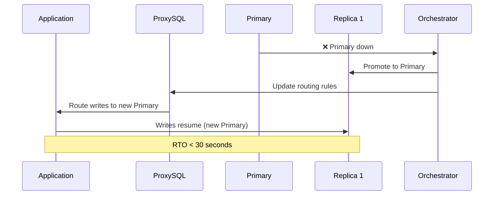

# Replication Topology / Cấu Trúc Replication

## Standard GTID Replication / Replication GTID Tiêu Chuẩn



---

## InnoDB Cluster Topology / Cấu Trúc InnoDB Cluster



---

## Failover Flow / Luồng Failover



---

## Replication Monitoring / Giám Sát Replication

```sql
-- Check replication lag / Kiểm tra độ trễ replication
SHOW REPLICA STATUS\G
-- Key metric: Seconds_Behind_Source

-- Check GTID status / Kiểm tra trạng thái GTID
SELECT @@global.gtid_executed;
SELECT @@global.gtid_purged;
```
